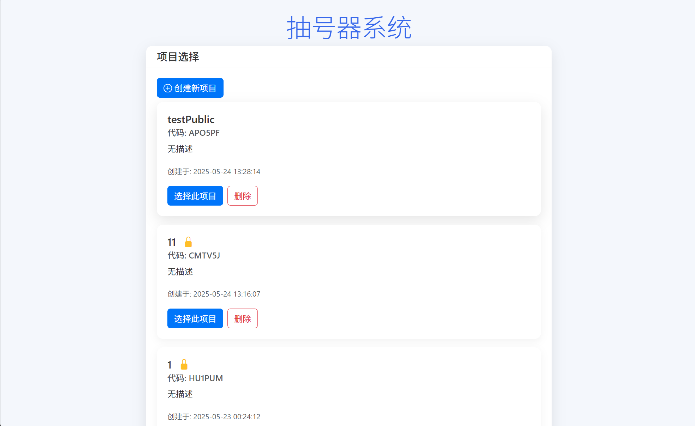
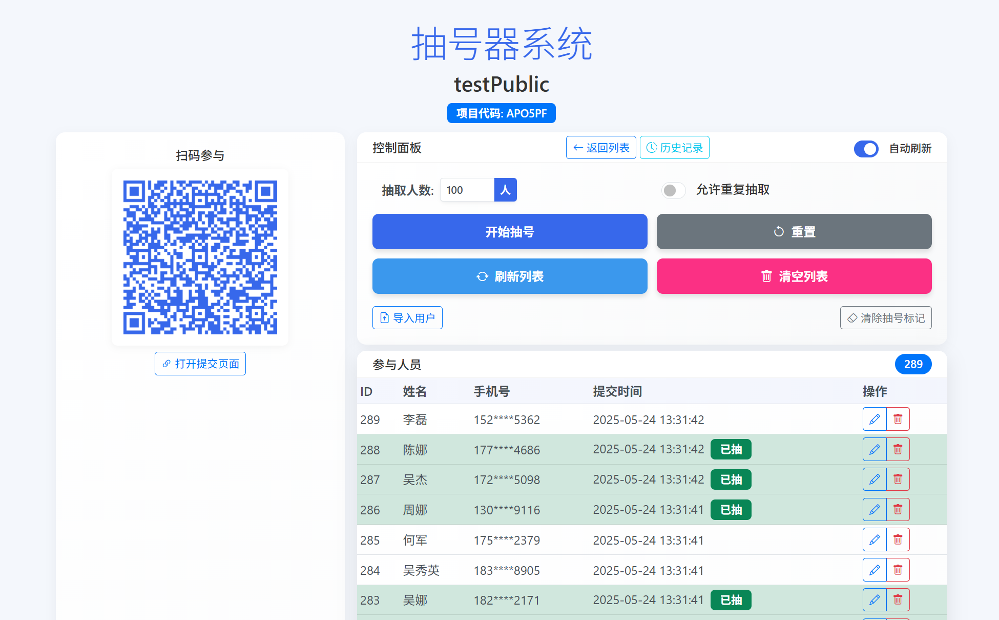

# QRandomSelectionHub

QRandomSelectionHub 是一个用于随机抽号、抽奖以及用户管理的开源 Web 应用。它提供了友好的管理后台、抽号功能、抽号历史记录以及一个便捷的用户参与提交页面。该项目基于 PHP、JavaScript 和 Bootstrap 构建，支持文件上传、数据备份、并发写入控制以及密码保护等功能，适合用于各类抽奖活动和随机选择任务。

------

### 测试网站

http://47.113.187.48/QRandomSelectionHub/

## 截图

## 目录

- [功能介绍](https://ai.whx1216.top/chat?topic=tpc_OLQgTTNAzNkW#功能介绍)
- [架构与文件结构](https://ai.whx1216.top/chat?topic=tpc_OLQgTTNAzNkW#架构与文件结构)
- [安装与配置](https://ai.whx1216.top/chat?topic=tpc_OLQgTTNAzNkW#安装与配置)
- 使用说明
	- [项目管理](https://ai.whx1216.top/chat?topic=tpc_OLQgTTNAzNkW#项目管理)
	- [参与者管理](https://ai.whx1216.top/chat?topic=tpc_OLQgTTNAzNkW#参与者管理)
	- [抽号功能](https://ai.whx1216.top/chat?topic=tpc_OLQgTTNAzNkW#抽号功能)
	- [用户提交页面](https://ai.whx1216.top/chat?topic=tpc_OLQgTTNAzNkW#用户提交页面)
- [API 接口说明](https://ai.whx1216.top/chat?topic=tpc_OLQgTTNAzNkW#api-接口说明)
- [前端代码说明](https://ai.whx1216.top/chat?topic=tpc_OLQgTTNAzNkW#前端代码说明)
- [贡献](https://ai.whx1216.top/chat?topic=tpc_OLQgTTNAzNkW#贡献)
- [许可协议](https://ai.whx1216.top/chat?topic=tpc_OLQgTTNAzNkW#许可协议)

------

## 功能介绍

-  

	**项目管理**

	- 创建、查询、删除抽奖项目
	- 支持受密码保护的项目（验证密码、基于 token 的会话管理）

-  

	**参与者管理**

	- 添加、修改、删除参与用户信息
	- 支持导入用户（CSV、Excel、JSON、TXT 等格式），并自动检测重复手机号
	- 用户数据通过 JSON 文件存储，并支持自动备份和安全锁机制

-  

	**抽号功能**

	- 支持随机抽取指定数量的参与者（允许或不允许重复抽取）
	- 抽号过程带动画展示和声音提示
	- 抽号结果会保存到抽号历史中，并可分页查看、导出

-  

	**抽号历史**

	- 显示所有抽号记录（ID、时间、参与人数、描述等）
	- 支持删除或清空抽号历史记录

-  

	**前端展示**

	- 管理后台采用 Bootstrap 和 Animate.css 构建，UI 简洁美观
	- 项目选择、抽号控制、用户列表等均采用响应式设计
	- 提供二维码技术，便于用户扫码参与

-  

	**日志与错误处理**

	- 后台操作详细记录日志，便于调试和问题排查
	- 文件操作、并发控制以及错误提示都经过精心设计

------

## 架构与文件结构

项目主要目录及文件如下：

QRandomSelectionHub/
├── api/
│ ├── add_user.php —— 添加用户 API
│ ├── clear_history.php —— 清空抽号历史记录 API
│ ├── clear_users.php —— 清空参与者数据 API
│ ├── create_project.php —— 创建项目 API
│ ├── delete_history.php —— 删除单条抽号历史记录 API
│ ├── delete_project.php —— 删除项目 API
│ ├── delete_user.php —— 删除用户 API
│ ├── draw.php —— 抽号功能 API
│ ├── edit_user.php —— 编辑用户 API
│ ├── get_draw_history.php —— 获取抽号历史 API
│ ├── get_projects.php —— 获取项目列表 API
│ ├── get_users.php —— 获取参与者列表 API
│ ├── import_users.php —— 导入用户接口 (支持 CSV/Excel/JSON/TXT)
│ ├── save_draw_history.php —— 保存抽号历史记录 API
│ ├── SimpleXLSX.php —— 处理 Excel 文件的第三方库
│ ├── verify_project_password.php —— 验证项目密码 API
│ └── verify_token.php —— 验证会话令牌 API
├── css/
│ ├── style.css —— 主样式表
│ └── submit.css —— 用户提交页样式
├── data/
│ ├── backups/ —— 数据文件备份目录
│ ├── history/ —— 抽号历史记录存储目录
│ ├── projects/ —— 各项目参与者数据目录
│ ├── config.php —— 数据目录、常量等配置文件
│ ├── projects.json —— 项目列表数据
│ └── tokens.json —— 会话令牌数据
├── includes/
│ └── functions.php —— 项目通用函数库（日志、数据操作、验证等）
├── js/
│ ├── main.js —— 管理后台前端逻辑
│ ├── qrcode.min.js —— 生成二维码的库
│ └── submit.js —— 用户提交页面前端逻辑
├── logs/
│ └── api_YYYY-MM-DD.log —— API 访问日志（按日期生成）
├── index.php —— 后台入口页（项目选择、抽号、管理等）
├── LICENSE —— 开源许可文件
└── submit.php —— 用户参与提交页

------

## 安装与配置

### 环境要求

- PHP 7.2 及以上（推荐 PHP 8+）
- Web 服务器（如 Apache、Nginx 等）
- 支持 JSON 扩展（一般默认安装）

### 安装步骤

1. **下载源码**
	克隆本仓库或下载 ZIP 包后解压，将代码部署至 Web 服务器的根目录中。

2. **配置数据目录**
	编辑 `data/config.php` 文件，确认 DATA_PATH（数据存储路径）设置正确，并确保 Web 服务器对该目录具有读写权限。

	为了方便部署没有使用sql，数据均以json储存

	默认不编辑则数据储存在config.php同目录中

	部署在生产环境中注意DATA_PATH安全，建议DATA_PATH在服务器域外，用户不可访问

	同时，检查 logs 目录是否存在，若不存在则系统会自动创建。

3. **安装依赖**
	项目主要依赖 Bootstrap、Animate.css、Bootstrap Icons 和二维码库。相关前端的依赖通过 CDN 加载，无须额外安装。

4. **配置 Web 服务器**
	如果使用 Apache，请确保 `.htaccess` (如果需要 URL 重写) 设置正确。
	如果使用 Nginx，确保静态文件（CSS、JS）能够正确访问。

5. **测试安装**
	通过浏览器访问 `index.php` 或主 URL，若页面正确加载，则说明环境搭建成功。

------

## 使用说明

### 项目管理

-  

	**创建项目**
	在项目选择页面点击“创建新项目”，填写项目名称、描述及（可选）密码信息。提交后会生成一个自动生成的 6 位项目代码。项目数据将保存到 `data/projects.json`，并在 `data/projects/` 下创建对应的参与者数据文件（users.json）。

-  

	**选择项目**
	在项目列表中可选择已有项目。如果项目受密码保护，系统会提示输入密码进行验证。

-  

	**删除项目**
	在项目列表或项目详情页面中选择删除项目。系统会备份用户数据和历史记录后删除项目目录。删除后的项目信息在 `data/projects.json` 中也会移除。

### 参与者管理

-  

	**添加用户**
	通过提交页面（submit.php）让参与者填写姓名、手机号及备注完成信息提交。
	前端校验手机号格式（中国大陆11位号码），后台会进一步验证数据。成功后用户信息会存入项目对应的 `projects/PROJECT_CODE/users.json` 文件。重复手机号提交会被拒绝。

-  

	**编辑、删除用户**
	在后台用户列表中可对用户信息进行编辑或删除。同操作均带有文件锁控制及数据备份功能，确保数据一致性。

-  

	**导入用户**
	支持通过 CSV、Excel、JSON 或 TXT 文件批量导入，系统会自动检查数据完整性、格式正确性和重复手机号，并备份原有数据。

-  

	**清空用户列表**
	后台提供清空所有参与者数据（同时自动备份）的功能。

### 抽号功能

-  

	**随机抽号**
	在后台可设置抽取人数以及是否允许重复抽取。抽号过程含有动画效果、滚动展示以及最终动态显示中奖结果。
	如果不允许重复抽取，系统会记录已抽取用户标记，直至所有参与者均已中选，然后提示清除标记以重新开始。

-  

	**抽号历史纪录**
	抽号记录会保存到 `data/history/PROJECT_CODE/draw_history.json` 文件。可以在后台查看历史记录、分页浏览、导出或删除单条历史记录。

### 用户提交页面

- 用户提交页面（submit.php）为活动参与者提供简单的表单。支持手机号码格式验证、错误提示及成功后的页面提示用户信息已提交。

------

## API 接口说明

所有 API 均支持 CORS（跨域请求），采用 JSON 格式返回数据。详细接口说明请参考以下目录及代码注释：

- `/api/add_user.php` — 提交用户信息
- `/api/edit_user.php` — 编辑用户信息
- `/api/delete_user.php` — 删除用户
- `/api/get_users.php` — 获取参与者列表（支持分页）
- `/api/import_users.php` — 导入用户
- `/api/create_project.php` — 创建项目
- `/api/delete_project.php` — 删除项目
- `/api/verify_project_password.php` — 验证项目密码
- `/api/verify_token.php` — 验证会话令牌
- `/api/draw.php` — 执行抽号
- `/api/get_draw_history.php` — 获取抽号历史
- `/api/delete_history.php` — 删除单条抽号历史
- `/api/clear_history.php` — 清空所有抽号历史
- `/api/clear_users.php` — 清空用户列表
- `/api/save_draw_history.php` — 保存抽号历史记录

------

## 前端代码说明

-  

	**js/main.js**
	控制后台管理页面逻辑，包括项目选择、抽号、用户列表刷新、操作模态框、抽号动画及结果展示等。

-  

	**js/submit.js**
	实现用户提交页面的表单验证、数据传输及成功提示。

-  

	**CSS 文件**
	`css/style.css` 用于后台页面样式，`css/submit.css` 用于用户提交页面样式。

-  

	**第三方库**

	- Bootstrap、Animate.css 及 Bootstrap Icons 来自 CDN
	- QRCode 库用于生成二维码
	- SimpleXLSX（位于 api 目录）用于处理 Excel 文件

------

## 贡献

欢迎欢迎各位开发者贡献代码或提出建议。
请提交 Issue 或 Pull Request 来报告 bug、请求新功能或讨论改进方案。

**⭐ 如果这个项目对你有帮助，请给个Star支持一下！**

------

## 许可协议

本项目采用 MIT 许可协议。详细许可条款请参见 LICENSE 文件。